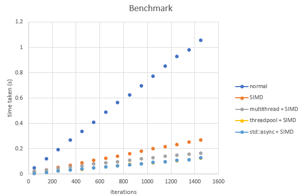

# Mandelbrot-SIMD-Multithreading
MandelBrot program to understand and compare the performance of SIMD and threading, threadpools and std::async. olcPixelGameEngine by javidx9 is used.

this program compares the performance of computing the Mandrelbrot set with various optimizations. The methods used are:

default algorithm  
SIMD  
multithreading and SIMD  
threadpool and SIMD  
std::async and SIMD  

 

## Benchmark Results
CPU : intel i7-7700 HQ (4 cores 8 threads)  
This benchmark is roughly the whole Mandrelbot set. In reality, the set can be zoomed in and out which will cause different results, dpeending on the region. Overall, the threadpool and std::async was the fastest, with minimal differences. The task granularity is experimented as well, and smalelr tasks displayed better performance, however for the multithreaded (non-threadpool) version, it displayed the worst performance, as the overhead of creating and joining threads was pretty big. 
  
 

## Using the Program
Requires Visual Studio 2017 minimum. Simply download the git repo and run the project. 
Use keys 1,2,3,4,5 to alter between computation methods.  
Use the up and down arrow keys to increase or decreases iterations for the set.   
To sample the time taken for a particular iteration and parse it into a csv file, press S.
