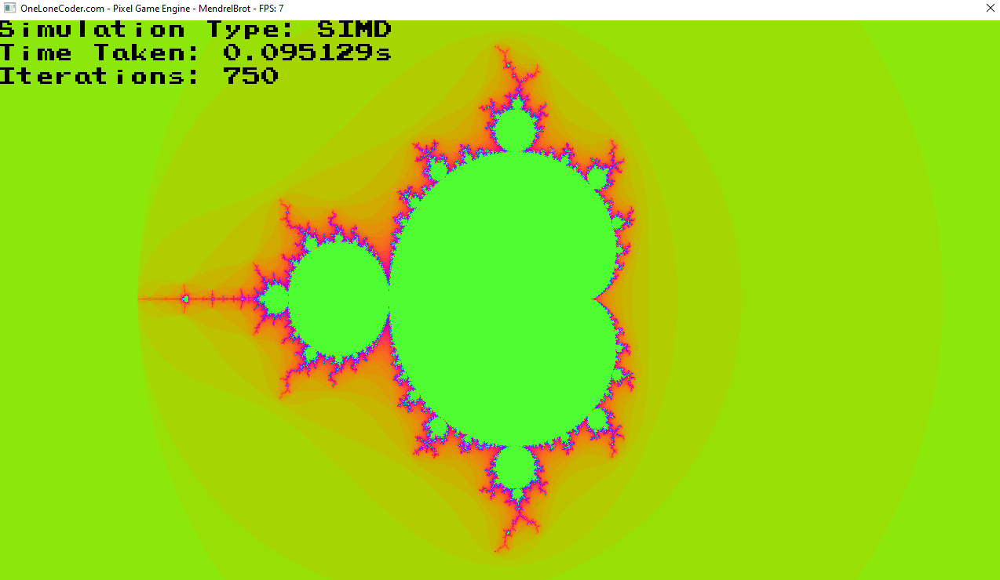

# Mandelbrot-SIMD-Multithreading
MandelBrot program to understand and compare the performance of SIMD and threading, threadpools and std::async. olcPixelGameEngine by javidx9 is used.

this program compares the performance of computing the Mandrelbrot set with various optimizations. The methods used are:

default algorithm  
SIMD  
multithreading and SIMD  
threadpool and SIMD  
std::async and SIMD  

 
